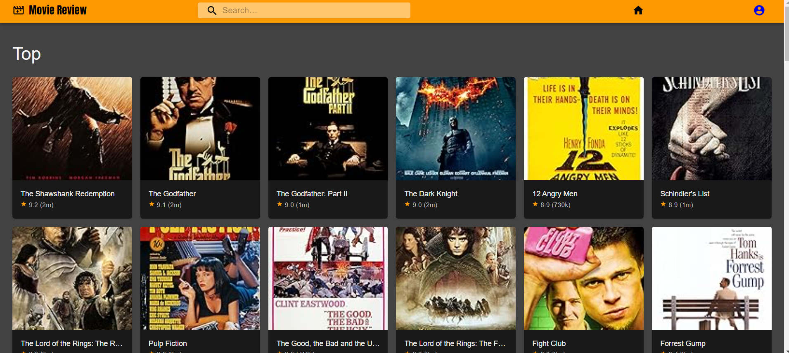
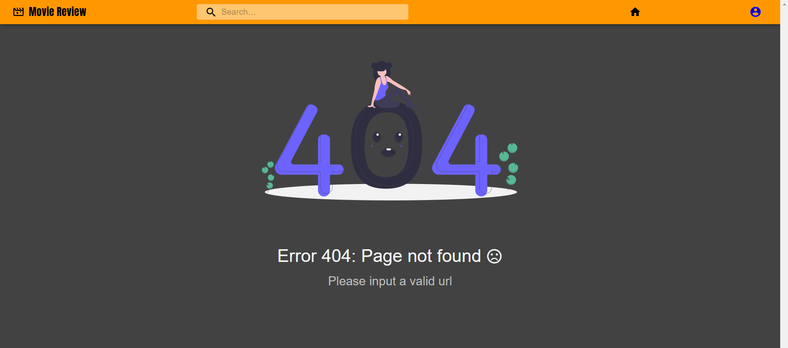

# Movie Review Site

## Overview
This is a movie review site built using React. Users can browse through a collection of movies, read reviews, and leave their own reviews. The site utilizes React hooks such as `useState` and `useEffect` for state management and interacting with APIs to fetch movie data.

## Features
- Browse through a collection of movies
- Read reviews from other users
- Leave reviews for movies
- Search for specific movies
- Sort movies by different criteria

## Technologies Used
- React
- React Hooks (useState, useEffect)
- APIs for fetching movie data
- HTML/CSS for styling

## Screenshots

*Caption for Screenshot 1*

*Caption for Screenshot 2*

## Installation
1. Clone the repository: `git clone <repository-url>`
2. Navigate to the project directory: `cd movie-review-site`
3. Install dependencies: `npm install`
4. Start the development server: `npm start`
5. Open your browser and visit `http://localhost:3000` to view the application.

## Usage
- Browse through the list of movies on the homepage.
- Click on a movie to view more details and read reviews.
- Leave a review by filling out the form on the movie details page.
- Use the search bar to find specific movies.
- Sort movies by different criteria such as release date or rating.

## Contributing
Contributions are welcome! Feel free to open issues or pull requests.

